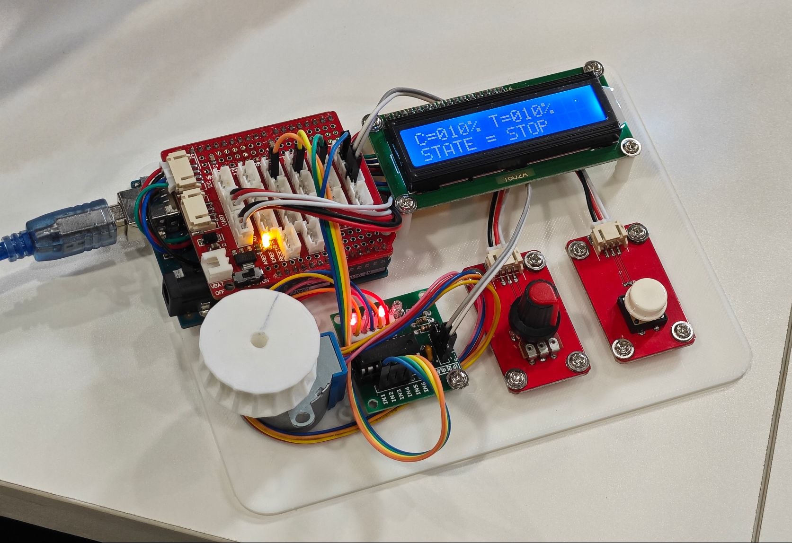

# SmartCurtains Controller

Simple **smart curtains** controller based on **Arduino Uno R3** with OpenJumpers module.

## Open Source Licence

The source code of this project adopts the [GNU General Public License v3.0](https://opensource.org/licenses/GPL-3.0).

## Supports

Many thanks to Jetbrains for kindly providing a license for us to work on this and other open-source projects.  

