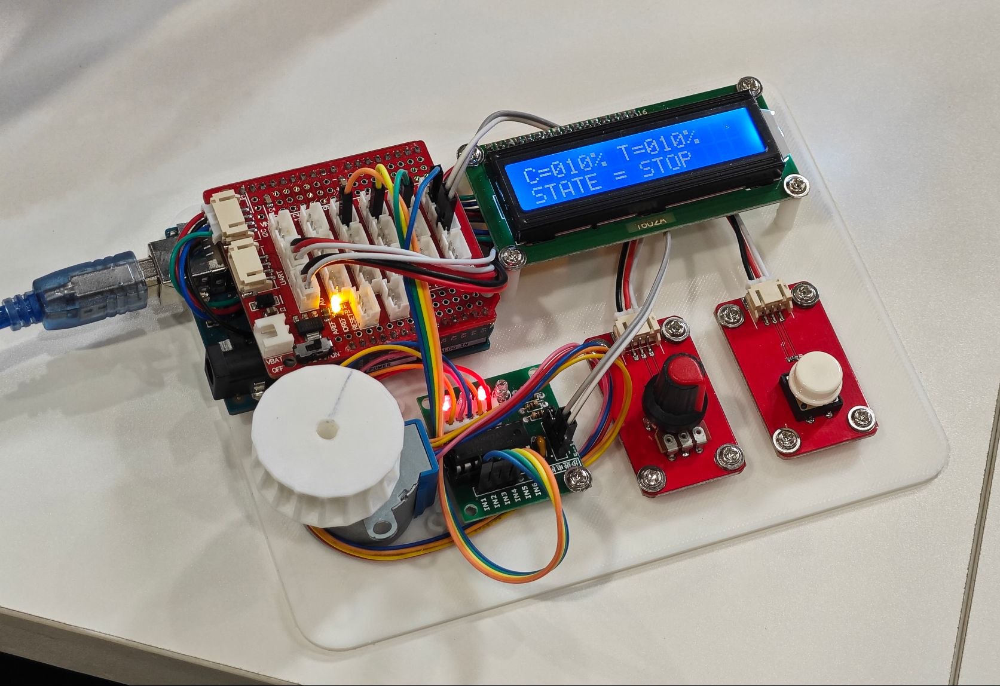

# SmartCurtains Controller

Simple **smart curtains** controller based on **Arduino Uno R3** with [OpenJumper](https://www.openjumper.com/)'s module.

## Features

- Knob to control the curtains position (0-100%)
- Button to execute the command
- LCD to indicate the status of the curtains

## Components

- 1 x Arduino Uno R3
- 1 x OpenJumper Motherboard
- 1 x Stepper Motor
- 1 x Stepper Motor Driver
- 1 x OpenJumper Button
- 1 x OpenJumper Knob
- 1 x OpenJumper LCD (1602A/PCF8574)
- 1 x 3D-Printed Baseboard (optional) [3D Print](.res/baseboard.STL)

## Open Source Licence

The source code of this project adopts the [GNU General Public License v3.0](https://opensource.org/licenses/GPL-3.0).

## Supports

Many thanks to Jetbrains for kindly providing a license for us to work on this and other open-source projects.  

